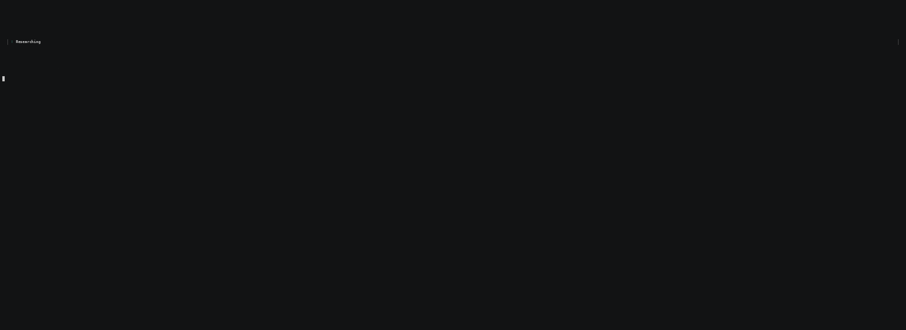

# reasoning.run

[](https://www.npmjs.com/package/reasoning.run)
[](https://www.npmjs.com/package/reasoning.run)
[](LICENSE)
[](package.json)
[](https://github.com/lloyal-ai/reasoning-run/actions/workflows/ci.yml)

Run the model in your own process and fork agents from one shared context — 10 GLM-5.2
agents decode in a single `llama_decode` per step, for about the GPU compute of one.

A private reasoner for your terminal — direct chat or grounded multi-agent research,
GPU-native and fully local. No API keys, no inference servers. MIT.

```
npx reasoning.run
```

Then type a research question.

<p>
  
  <br>
  <em>GLM-5.2 (Unsloth UD-IQ2_M 2-bit, ~239 GB) · 10 agents forked from one shared context · one <code>llama_decode</code> per step · one box (2× B200, rented by the hour) · a real deep-research task, end to end through synthesis</em>
</p>

> Built with **[HDK](https://hdk.lloyal.ai/)** — Lloyal's Harness Development Kit. An in-app intelligence runtime for local-first apps: models, agents, tools, and retrieval in one import — no model server, no API keys.

## Requirements

- **Node ≥ 24.** Enforced via `engines`; Node 20/22 won't install.
- **Apple Silicon M2+ with ≥ 10 GB free memory** for the default local models — Metal is automatic, no flags.
- **x64 needs AVX2** (Intel Haswell / 2013+, or AMD Zen). Linux, macOS, and native Windows are all supported — Windows + CUDA is a tested path here (it's the daily dev box: Ryzen + RTX 3080).
- **First run downloads ~3 GB** of default models into `~/.cache/lloyal/models/`. After that it's local.
- **GLM-5.2-class models want a datacenter GPU.** The run above used a 2-bit Unsloth quant (~239 GB) on one box; a single 288 GB card (a B300) fits it, or a pair of smaller cards. Rent one by the hour when you need it — nothing about the harness changes between your laptop and the datacenter.

## What you get

<p>
  
  <br>
  <em>The fully-local path: Qwen3.5 4B + Qwen3 0.6B reranker · 5 parallel agents · shared 32K context · offline on an M2 MacBook Pro 16 GB</em>
</p>

- **Plan, edit, run.** A small planner decomposes your question into research tasks. You see the plan in a TUI editor — navigate with ↑↓, edit a task with ⏎, add/delete/reorder with `A`/`D`/`⇧↑↓`. Press START on a plan you actually agree with. Nothing runs until you say so.
- **Many agents in one context window.** HDK's [Continuous Context](https://docs.lloyal.ai/under-the-hood/continuous-context-spine) lets agents share GPU KV state, not strings — five research agents fit inside a single 32K-token budget on a 16 GB MacBook, and the same mechanism scales to ten frontier agents on a datacenter box. Decoded in-process, on the device that asked.
- **Retrieval inside the loop.** Each agent searches, fetches, and reranks chunks *during* generation via HDK's [RIG](https://docs.lloyal.ai/build-an-app/sources-and-retrieval) primitives — keyless web search by default (Tavily optional), local markdown for corpus. Adaptive tool use, multi-hop reasoning.
- **Warm follow-ups.** Subsequent queries in the same session reuse the trunk's KV. The planner runs instantly; agents fork from a context that already remembers the prior turn.
- **Hot model swap.** `/model <path>` rebuilds the harness against a new `.gguf` mid-session. Test against different model sizes and quants in seconds, same process.
- **Bundled output per query.** `report.md` (synth answer) + `annexure-N.md` (each research agent's full report) on disk. Grep, diff, share.

First run downloads a Qwen3.5-4B LLM and Qwen3 reranker (~3 GB total, cached in `~/.cache/lloyal/models/`). After that it's all local.

## Why the 10th agent is ~free

The shared context — system prompt, tool schemas, and the roster of who's covering what — is decoded **once** into the KV cache.

Spawning agents two through ten is a `seq_cp`: it walks the shared cells and sets one more owner bit on each. No new cells, no buffer copy, zero decode or attention compute — a single physical cell can carry many owners at once.

On every generation step, all live agents decode in **one** `llama_decode`, not ten. The GPU sees token rows each tagged with the agent that owns it, not an "N sequences" dimension — so dispatch count is O(1) in the number of agents.

So you pay for the frontier model once and the shared context once. Per-step wall-time scales with how full the cache is, not with how many agents are in it; two agents and ten decode at the same per-step speed.

The honest floor: concurrency is free on compute and **paid in space**. Every agent that diverges grows its own private tail in the KV cache, so the ceiling on how wide you fan out is cache size, not FLOPs. We turned a compute multiplier into a memory budget.

Full mechanism, traced line-by-line to the inference kernel: <!-- PENDING: article URL -->

### Prior art

Forking a shared KV prefix isn't our invention. SGLang's `fork` and RadixAttention have served shared-prefix workloads in production, and a line of research explores the same physics — decode a prefix once, let many continuations attend to it without re-decoding. What reasoning.run composes differently: the runtime lives inside your Node process (no model server to stand up), forks are governed by structured-concurrency scopes with per-agent policies, and all live agents decode in one lockstep `llama_decode` per step. The primitive is known; the in-process, harness-side packaging is the point.

## The part you can check

We'd rather you verify than take our word for it.

- **A full research run, end to end.** A GLM-5.2 fan-out on one box, published with the synthesized report, every agent's annexure, the session trace (`trace-*.jsonl`), and the exact config — so you can replay the fan-out, watch the corrections happen when a source turns out to be about the wrong thing, and check the cost model against cache occupancy yourself. <!-- PENDING: run-bundle URL -->
- **The 10-agent run, as it happened.** The asciinema cast of the ten columns going live, plus the receipt: 2× B200 rented on RunPod, ~82-minute session, ≈ $16. For this one we publish the cast and the cost, not a per-agent trace — it was captured for the visual and the step-level JSONL wasn't retained. <!-- PENDING: run-bundle URL -->

A note on the policy behind the numbers: breadth is cheap here and depth is where the cost lives, so we fan out wide on discovery and keep each agent's private reasoning tail as small as the task allows. Concurrency is free on compute; you pay for it in KV space, and the ceiling is how much cache fits on the box.

## FAQ

**Is this just an API wrapper?**
No. The model runs in-process through [`@lloyal-labs/lloyal.node`](https://www.npmjs.com/package/@lloyal-labs/lloyal.node), a llama.cpp Node binding — no server, no network hop, no per-token bill. Every token is decoded on the machine that asked the question. Nothing leaves the process unless a tool (like web search) deliberately reaches out.

**Do I need the CUDA toolchain, or to compile anything?**
No. `npx reasoning.run` pulls a prebuilt binary. On macOS, Metal is automatic. On Linux or Windows with an NVIDIA GPU, pass `--gpu cuda`; the first CUDA run can fetch a signed backend pack (you get a Download / Not now prompt). No `nvcc`, no local build step.

**What hardware do I need for GLM-5.2?**
For the default Qwen models: an M2+ Mac with ≥ 10 GB free memory, or an AVX2 x64 box. GLM-5.2 is large — the 10-agent run used a 2-bit Unsloth quant (~239 GB) on datacenter GPUs, and a single 288 GB card fits it. Rent one by the hour. Smaller and more heavily quantized GLM variants run on less.

**How is this different from node-llama-cpp, an SGLang server, or Ollama?**
Different job — and we build on the same layer several of them do. `node-llama-cpp` (and llama.cpp) give you a model in a process; reasoning.run adds the agent orchestration, KV-forking, retrieval-in-the-loop, and TUI on top. Ollama is an excellent local model *server* you call over HTTP; here there is no server — the model lives inside the harness so agents can share and fork one KV context. SGLang is a production serving stack with its own `fork`/RadixAttention: a different deployment shape (a server tier your app calls) built for a different scale. If you want a local model endpoint, reach for those. If you want to write a multi-agent application with the model *inside* it, that's this.

## Configuration

State lives in `./harness.json` (auto-created, auto-gitignored on first save):

```jsonc
{
  "sources": {
    "outputDir": "./reasoning-runs"    // optional — defaults to cwd
  },
  "apps": {                            // per-app config, keyed by app name
    "web": { "tavilyKey": "tvly-..." },    // optional — web search is keyless by default
    "corpus": { "corpusPath": "/path/to/docs" }  // optional — local markdown corpus
  },
  "defaults": {
    "reasoningMode": "flat",           // or "deep"
    "effort": "high"                   // or "medium" | "low"
  },
  "model": {
    "path": "/path/to/llm.gguf",       // optional — local LLM (else catalog default)
    "reranker": "/path/to/rerank.gguf",// optional — local reranker (else catalog default)
    "nCtx": 32768,                     // LLM context window
    "gpu": "cuda"                      // optional — GPU backend (cuda|vulkan|default); omit on macOS (Metal is automatic)
  }
}
```

### Slash commands

Type `/` in the composer to open the command palette. Tab autocompletes; Enter runs.

| Command | Effect |
|---|---|
| `/web <key>` | Set the optional Tavily key (web search works keyless without it). Empty clears. |
| `/scan <path>` | Set local file/glob source. Empty value clears. |
| `/output <dir>` | Set the run-artifact output directory. Empty value resets to cwd. |
| `/model <path>` | Use a local LLM `.gguf` instead of the catalog default. |
| `/reranker <path>` | Use a local reranker `.gguf` instead of the catalog default. |
| `/gpu <cuda\|vulkan\|default>` | Set the GPU backend; restarts the model on the new binding. |
| `/deep` | Switch to deep (chain) reasoning mode. |
| `/flat` | Switch to flat (parallel) reasoning mode. |
| `/help` | Show the command list inline. |
| `/quit` | Exit. |

Settings persist to `harness.json` the moment you submit. `/model` and `/reranker` **hot-swap the live model mid-session**: type `/model ~/qwen3-8b.gguf` and the harness disposes the current `ctx`, downloads (if needed), loads the new weights, and returns you to the composer — same process, same Ink session, no restart. (Same flow recovers from boot-time download failures: type `/model <path>` at the BootStatus prompt to continue with a local file.)

## Run artifacts

Every query writes a self-contained bundle under `<output-dir>/<ISO-timestamp>/`:

```
<output-dir>/
  trace-2026-05-01T12-34-56.jsonl       ← session trace (one per process invocation)
  2026-05-01T12-34-56/                  ← query 1
    report.md                           ← synth answer + metadata + annexure index
    annexure-1.md                       ← research agent 1's report
    annexure-2.md
    annexure-3.md
  2026-05-01T13-02-11/                  ← follow-up query 2
    report.md
    annexure-1.md
```

`<output-dir>` defaults to the directory you launched from. Override with `--output-dir <path>` or the composer's `O` hotkey. The session trace captures every query (including warm follow-ups) in one file.

### Environment overrides

- `TAVILY_API_KEY` — wins over the stored key; never persists to disk while set.
- `LLAMA_CTX_SIZE` — context window fallback.
- `LLOYAL_GPU` — GPU backend fallback (`cuda`|`vulkan`|`default`). A bare env var keeps the loader's warn-and-fall-back-to-CPU behavior; set `LLOYAL_NO_FALLBACK=1` to make an unavailable backend error instead. When the backend comes from `--gpu` or `harness.json`, fail-loud is the default.

## CLI flags

All optional. Anything you can set in `harness.json` you can also set on the command line; CLI > env > file > defaults. The first positional argument is the model `.gguf` path (equivalent to `--model`).

| Flag | Effect |
|---|---|
| `--query <q>` | Run one query non-interactively, then exit. Implied non-TTY mode. |
| `--model <path>` | Local LLM `.gguf` (same as the first positional / `/model`). |
| `--gpu <cuda\|vulkan\|default>` | GPU backend (same as `/gpu`; env `LLOYAL_GPU`). `default` = the platform binary's built-in backend — useful to clear a persisted choice. Explicitly requested backends fail loud at boot if the variant can't load. On macOS, Metal is automatic — no flag needed. |
| `--reasoning-mode <flat\|deep>` | Override the default reasoning mode. |
| `--n-ctx <int>` | LLM context window in tokens. |
| `--corpus <path>` | Local file/glob source (same as `/scan`). |
| `--output-dir <dir>` | Where run artifacts are written (same as `/output`). |
| `--backend-pack <download\|skip>` | BACKEND_DL pack behavior (Linux + `--gpu cuda`). Interactive boots offer a Download / Not now dialog when a signed full-architecture CUDA pack matches the detected GPU; `download` auto-accepts (headless/deploy), `skip` never probes. Declining in the dialog persists `model.backendPack: false` — the offer won't repeat until you edit `harness.json`. |
| `--reranker <path>` | Local reranker `.gguf` (same as `/reranker`). |
| `--findings-budget <int>` | Cap (in chars) on per-agent findings forwarded to synth. Default unbounded. |
| `--config <path>` | Use a non-default `harness.json`. |
| `--jsonl` | Stream events as JSONL to stdout (good for piping). |
| `--verbose` | Verbose logs. |

## Run controls

While a run is active the composer stays docked and morphs: the input row becomes a live status line, and the PLAN/START buttons become **WRAP UP / STOP**.

| Key | Effect |
|---|---|
| `⏎` | Fire the focused control. WRAP UP holds focus by default, so Enter = wrap up: stop spawning, drain live agents to best-effort reports, and synthesize from what's found so far. |
| `Tab` / `⇧Tab` | Move focus WRAP UP ↔ STOP (same grammar as PLAN/START). Firing STOP — discard the run, back to the composer — is always Tab-then-Enter: deliberate by construction. During discovery/planning only STOP exists and Enter fires it. |
| `1`-`9` | Cancel one flat-mode research agent by its `[N]` card badge (its task number). Siblings keep running; its budget frees up. Offered only while ≥2 agents are live. |

A cancelled agent freezes into scrollback marked `✕ cancelled`; a wrap-up shows `◐ WINDING DOWN` while agents write their reports.

## Keyboard shortcuts

Standard readline chords (work in every terminal):

| Chord | Effect |
|---|---|
| `Ctrl+A` | Jump to line start |
| `Ctrl+E` | Jump to line end |
| `Ctrl+U` | Clear to line start |
| `Ctrl+K` | Clear to line end |
| `Ctrl+W` | Delete word back |
| `Opt+Backspace` | Delete word back (macOS; requires "Use Option as Meta key" in Terminal.app) |
| `Ctrl+C` | Quit |

For Cmd+Backspace / Cmd+arrow to work, turn on "Natural Text Editing" in iTerm2, or use Ghostty.

## How it's built

reasoning.run is a working harness on [Lloyal's **Harness Development Kit**](https://hdk.lloyal.ai/) — the same primitives ship agentic AI directly into desktop and mobile apps, no cloud round-trip required. Specifically:

- **`useAgent`** — single agents with tools and a terminal report tool. Powers the planner, the bridge, and synth.
- **`agentPool` + `parallel`/`chain`** — multi-agent orchestration. Drives the research phase: parallel fan-out for `Flat` mode, chained tasks for `Deep` mode.
- **AgentApps** — capabilities arrive as AgentApps, registered with `createAppRegistry`. reasoning.run enables two: a **web** AgentApp (always on, keyless search by default — Tavily optional) and a **corpus** AgentApp (your local markdown). Each bundles a Source, its Tools, and a prompted skill; the catalog is decoded once into the shared spine, and every research agent reads its role from a short suffix. See [What is an AgentApp](https://docs.lloyal.ai/build-an-app/what-is-an-app).
- **Continuous Context** — agents share GPU KV state instead of re-tokenizing strings, so 5 concurrent agents fit inside one 32K-token context budget on consumer hardware. Also why subsequent queries in the same session are warm and instant — the prior turn's tokens are still in the trunk's KV. ([physics](https://docs.lloyal.ai/under-the-hood/continuous-context-spine))
- **Retrieval-Interleaved Generation (RIG)** — the web and corpus AgentApps return reranker-scored chunks inline *during* generation, so agents search, fetch, and reason in one loop. See [Sources & retrieval](https://docs.lloyal.ai/build-an-app/sources-and-retrieval).
- **Bring your own data — build an AgentApp.** Wrap a vector DB, REST API, JIRA, or any domain surface as an AgentApp and `registry.enable` it; the harness code doesn't change. See [Build an AgentApp](https://docs.lloyal.ai/build-an-app/what-is-an-app).
- **`@lloyal-labs/lloyal.node`** — llama.cpp Node binding for in-process inference.

reasoning.run is open source (MIT) — the whole harness, boot to TUI to research loop, is here to read and fork. If you want to build something similar — a local research tool, a domain-specific agent, an in-app assistant — read the [HDK docs](https://docs.lloyal.ai/) and start with `useAgent`.

UI is [Ink](https://github.com/vadimdemedes/ink) (React for terminals).

## License

MIT © 2026 Lloyal AI. See `LICENSE`. reasoning.run is open source — fork it, study it, ship your own. Its dependencies keep their own licenses: the HDK runtime (`@lloyal-labs/*`) is Fair Source (FSL-1.1-Apache-2.0), the `harness.dev` CLI is Apache-2.0.
